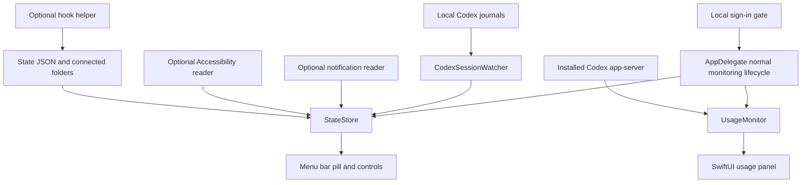

# Architecture

The inspected implementation is a native Swift executable built with Swift Package Manager. AppKit owns application lifecycle, menus, windows, and the rendered menu bar image. SwiftUI renders the usage panel. ServiceManagement handles Launch at Login; CryptoKit participates in the local sign-in verifier. Package.swift declares no external package dependencies.

The diagram describes the normal app. Standalone preview and diagnostic command-line paths are separate; usage preview can read account usage without passing the local UI gate.

## Components

| Source | Responsibility |
| --- | --- |
| `main.swift`, `AppDelegate.swift` | Launch modes, local gate, regular Dock app, application menu, monitoring lifecycle, controls |
| `Model.swift` | Status model, default configuration, filesystem observation, expiry, aggregation, dismissal |
| `CodexSessionWatcher.swift` | Incremental journal reads, task lifecycle, matching input requests, concurrent local sessions |
| `AXWatcher.swift` | Optional Accessibility traversal and control-based activity signals |
| `NotificationWatcher.swift` | Optional read-only notification database queries and keyword classification |
| `PillRenderer.swift` | Native vector badges, status symbols, idle cat |
| `UsageMonitor.swift` | Codex subprocess requests, response parsing, refresh timer, stale/unavailable presentation data |
| `UsagePanel.swift` | SwiftUI usage display, plan label, measured sections, controls, glass/material surfaces |
| `UsagePanelLayout.swift`, `UsagePopover.swift` | Height limits, scrolling and panel placement beneath the menu bar |
| `SignInGate.swift`, `SignInWindow.swift` | Existing offline gate and its local completion preference |
| `Log.swift` | Append-only local log, deleted/recreated after approximately 1 MB |
| `bin/agent-beacon`, `hooks/install-hooks.py` | Legacy state writer and host configuration changes |

## State resolution

The status enum is `working`, `attention`, or `done`. Attention reasons distinguish input, error, and limit. The store aggregates by agent, with attention outranking working and working outranking done. Local Codex sessions retain separate task state before aggregation. External JSON files are first reduced to the latest file state per agent.

The default done expiry is 600 seconds. External working/attention data expires based on its timestamp after 14,400 seconds; local active-session expiry instead uses journal modification time. Demo files expire after 60 seconds. Expiry filters old data without deleting it.

Clear operations behave differently: local sessions are hidden until a newer lifecycle state, while JSON files in watched directories can be deleted. This distinction matters for connected-folder data ownership.

## Activity and usage are independent

Activity comes from local events, files, accessible UI, or notifications. Usage comes from a separate Codex account query and is held in memory. There is no inferred relationship between a task's animation and its token consumption.

The usage response parser accepts multi-bucket and legacy response shapes, clamps finite percentages into 0–100, and preserves missing values. The normal app refreshes on start, on panel open, and every 60 seconds. A failure keeps existing values with a stale indication rather than manufacturing an update.

## Rendering and platform behavior

The pill is 22 points high. Its idle cat is vector-drawn; no animation asset download is needed. The normal usage panel is 360 points wide and anchored under the menu bar item. Measured content controls height, with scrolling limited to the usage list on constrained screens.

The source uses native macOS 26 glass conditionally and SwiftUI materials otherwise. It runs as a regular Dock application, not a menu-bar-only background agent. Reduce Motion participates in animation scheduling, but immediate reaction to a setting changed mid-animation is not established by this review.

## Trust boundaries and coupling

Journal and state formats, app bundle identifiers, accessible labels, the macOS notification database, and Codex app-server behavior are integration dependencies. They need compatibility checks across releases. No backend service, persistent usage-history database, updater, or remote agent-control protocol was found in the inspected app source.

See [privacy](privacy.md) for retained data, and [rename migration](../launch/RENAME.md) before changing identifiers or paths.
